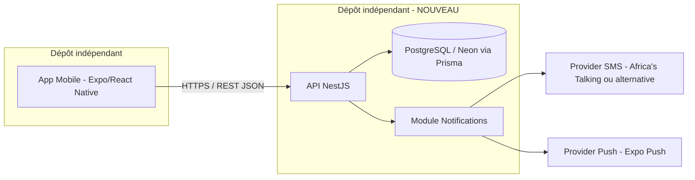

# ARCHITECTURE CIBLE — Souplesse Fitness Mobile
## Séparation Backend / Mobile & Plan de restructuration

---

## 1. Contexte et objectif

L'application Souplesse Fitness devient **exclusivement mobile** (Android en priorité, migration Play Store confirmée). Le code actuel (backend imbriqué dans le monorepo web Nuxt/Nitro) est jugé trop lourd et insuffisamment structuré. L'objectif de ce document est de définir une **architecture cible propre**, où :

- Le **backend** devient une **API autonome**, dans un **dépôt Git indépendant**.
- L'**application mobile** (Expo/React Native) ne fait que **consommer cette API** — aucune logique métier côté client au-delà de l'affichage et de la validation de formulaire.
- Le système de **notifications** (SMS via Africa's Talking, push) est **découplé et abstrait** pour ne plus être une dépendance rigide.

---

## 2. Vue d'ensemble



Deux dépôts Git totalement séparés, chacun avec son propre cycle de déploiement, ses propres tests, sa propre CI. Le seul point de contact est le **contrat d'API** (endpoints REST, schémas de requête/réponse).

---

## 3. Stack backend recommandée

| Composant | Choix | Justification |
|---|---|---|
| Framework | **NestJS** (TypeScript) | Structure modulaire imposée (modules/contrôleurs/services), injection de dépendances native — répond directement au problème de code désorganisé |
| ORM | **Prisma** (inchangé) | Fonctionne bien actuellement, aucune raison de migrer |
| Base de données | **PostgreSQL via Neon** (inchangé) | Déjà en place, garde-fous PITR déjà maîtrisés |
| Validation | class-validator + DTOs NestJS | Contrats d'entrée/sortie explicites et auto-documentés |
| Authentification | JWT (inchangé dans le principe), via un module `AuthModule` dédié avec Guards NestJS | Réutilise la logique existante mais l'isole proprement |
| Documentation API | **Swagger/OpenAPI** généré automatiquement par NestJS (`@nestjs/swagger`) | Contrat d'API explicite, utile pour le développement mobile en parallèle |

---

## 4. Structure de dossiers cible (backend)

```
souplesse-api/
├── src/
│   ├── auth/                  # Inscription, connexion, OTP, JWT, guards par rôle
│   │   ├── auth.module.ts
│   │   ├── auth.controller.ts
│   │   ├── auth.service.ts
│   │   └── dto/
│   ├── users/                 # Gestion des profils (Client, Coach, Modérateur, Admin)
│   ├── subscriptions/         # Formules, souscription, statut, historique
│   │   ├── subscriptions.service.ts   # contient la règle "pas de renouvellement si abonnement actif"
│   ├── payments/               # Soumission preuve de paiement, file de modération, validation/rejet
│   ├── coaching/                # Planification des séances Client/Coach
│   ├── notifications/          # Module d'abstraction — voir section 5
│   │   ├── notifications.module.ts
│   │   ├── notifications.service.ts       # interface unique appelée par le reste de l'app
│   │   └── providers/
│   │       ├── sms/
│   │       │   ├── sms-provider.interface.ts
│   │       │   └── africas-talking.provider.ts
│   │       └── push/
│   │           ├── push-provider.interface.ts
│   │           └── expo-push.provider.ts
│   ├── common/                 # Guards, decorators, filtres d'exception partagés
│   ├── prisma/                 # Service Prisma unique, injecté partout
│   └── main.ts
├── prisma/
│   └── schema.prisma
├── test/
└── .env.example
```

Chaque module métier (auth, subscriptions, payments, coaching) est **isolé** : il ne connaît des autres modules que ce qu'on lui expose explicitement (pas d'appels croisés implicites). C'est ce cloisonnement qui empêche le code de redevenir "lourd" avec le temps.

---

## 5. Refonte du système de notifications

**Problème actuel** : l'intégration Africa's Talking est probablement appelée directement depuis la logique métier (auth, paiements), ce qui la rend difficile à remplacer ou à tester.

**Solution** : une **interface commune**, indépendante du fournisseur :

```typescript
// sms-provider.interface.ts
export interface SmsProvider {
  sendOtp(phoneNumber: string, code: string): Promise<void>;
  sendNotification(phoneNumber: string, message: string): Promise<void>;
}

// push-provider.interface.ts
export interface PushProvider {
  send(userId: string, title: string, body: string): Promise<void>;
}
```

- `NotificationsService` est le **seul point d'entrée** utilisé par les autres modules (`notificationsService.notifyPaymentValidated(userId)`, par exemple) — il ne connaît pas Africa's Talking ni Expo Push directement, il délègue aux providers injectés.
- **Africa's Talking devient un provider interchangeable** : si vous voulez le remplacer (autre fournisseur SMS, coût, fiabilité) plus tard, un seul fichier change, aucun autre module n'est touché.
- Le **fournisseur push retenu (Expo Push Notifications, déjà décidé)** suit le même schéma.
- Cela permet aussi de créer un `FakeSmsProvider` / `FakePushProvider` pour les tests automatisés, sans dépendre d'un vrai envoi de SMS.

### 5.1 Étude comparative des fournisseurs SMS/OTP pour le Bénin

Le problème signalé n'est pas la fiabilité mais la **maîtrise du produit** — c'est justement ce que l'abstraction ci-dessus résout en partie (le reste de l'app ne dépend plus des détails d'un fournisseur précis). Voici néanmoins un comparatif pour choisir en connaissance de cause :

| Fournisseur | Couverture Bénin | Modèle tarifaire | Complexité d'intégration | Points forts | Points faibles |
|---|---|---|---|---|---|
| **Africa's Talking** (actuel) | Listé pour le Bénin (MTN, Moov, Celtiis) via routes agrégées | Portefeuille prépayé, paiement à l'usage, tarifs par pays | REST simple, mais documentation et support historiquement plus orientés Afrique de l'Est (Kenya/Ouganda) que Afrique de l'Ouest francophone | Spécialiste panafricain, déjà intégré et fonctionnel chez vous | Documentation parfois moins mature pour le Bénin spécifiquement ; support en anglais uniquement |
| **eSMS Africa** | Revendique des connexions **directes** avec MTN, Moov Africa et Celtiis au Bénin, conformité ARCEP mentionnée | Paiement à l'usage | API REST, orientation marché africain francophone | Spécifiquement positionné sur le marché béninois et l'Afrique francophone | Acteur moins établi/connu que les grands noms — à valider par un test réel avant d'engager du volume |
| **Twilio** | Couverture mondiale mais **pas de connexion opérateur directe** connue au Bénin (route internationale) | ~0,008 $/SMS + Twilio Verify ≈ 0,05 $/vérification (coûteux à l'échelle) | Excellente documentation, SDK très mature | Fiabilité et outillage best-in-class, monitoring des livraisons | Coût élevé si vous utilisez l'API Verify ; route internationale potentiellement moins directe qu'un spécialiste africain |
| **Infobip** | Couverture mondiale (190+ pays), Bénin inclus | Tarification **sur devis uniquement**, pas de grille publique | Plateforme riche mais jugée complexe pour les petites structures | Très robuste à grande échelle, suite complète (SMS, WhatsApp, voix) | Cycle commercial nécessaire, complexité disproportionnée pour le volume d'une salle de sport |
| **Vonage (Nexmo)** | Bénin supporté, Sender ID alphanumérique dynamique accepté (sauf MTN) | Paiement à l'usage, paliers de volume | API REST correcte | Bonne réputation, multi-canal | Restriction du Sender ID sur MTN Bénin à vérifier concrètement pour votre cas |

**Recommandation** : à votre échelle (volume faible à modéré, budget contraint), rester sur **Africa's Talking** derrière la nouvelle interface `SmsProvider` est raisonnable — le vrai problème (le code mal maîtrisé) est résolu par l'abstraction, pas en changeant de fournisseur. Je suggère toutefois d'ouvrir un compte de test chez **eSMS Africa** en parallèle (connexions directes revendiquées avec MTN/Moov/Celtiis, exactement vos trois opérateurs) et de comparer les taux de livraison réels sur quelques centaines d'OTP avant de trancher définitivement. Twilio et Infobip sont à écarter pour ce volume : coût ou complexité disproportionnés.

---

## 6. Contrat d'API — périmètre initial

L'API expose uniquement ce dont le mobile a besoin, rien de plus (pas de logique web héritée) :

| Domaine | Endpoints (exemples) |
|---|---|
| Auth | `POST /auth/register`, `POST /auth/verify-otp`, `POST /auth/login`, `POST /auth/refresh` |
| Utilisateurs | `GET /users/me`, `PATCH /users/me` |
| Abonnements | `GET /subscriptions/plans`, `POST /subscriptions`, `GET /subscriptions/me`, `PATCH /subscriptions/:id/pause`, `PATCH /subscriptions/:id/resume` |
| Paiements | `POST /payments/proof`, `GET /payments/pending` (Modérateur), `PATCH /payments/:id/validate`, `PATCH /payments/:id/reject` |
| Coaching | `GET /coaching/slots`, `POST /coaching/bookings` |

La règle métier confirmée — **pas de nouvelle demande de paiement tant qu'un abonnement est actif ou en pause** — est appliquée côté `subscriptions.service.ts`, jamais côté mobile (le mobile ne fait qu'afficher l'erreur renvoyée par l'API).

---

## 7. Plan de migration (progressif, pas de big-bang)

Le code actuel fonctionne (auth, OTP SMS en place) — on ne jette pas ce qui marche, on le **réorganise** :

1. **Créer le nouveau dépôt `souplesse-api`**, structure NestJS vide (section 4).
2. **Migrer le module Auth en premier** (le plus abouti actuellement) : réécrire dans la nouvelle structure, réutiliser le schéma Prisma existant tel quel, brancher le module Notifications avec Africa's Talking derrière l'interface.
3. **Valider en staging** que l'inscription/connexion/OTP mobile fonctionne à l'identique via le nouveau backend (staging séparé déjà décidé — s'y connecte directement).
4. **Migrer Abonnements puis Paiements**, module par module, chacun testé avant de passer au suivant.
5. **Basculer l'app mobile** pour pointer vers le nouveau backend (`EXPO_PUBLIC_API_URL` vers `souplesse-api`) une fois les modules critiques validés.
6. **Débrancher** l'ancien backend imbriqué du monorepo web une fois la bascule confirmée stable.

---

## 8. Ce qui ne change pas

- Base de données PostgreSQL/Neon et son contenu (aucune migration de données, seulement du code applicatif).
- Le principe de vérification SMS obligatoire pour le mobile.
- Le flux de paiement manuel (aucun paiement in-app).
- Les garde-fous de migration de schéma (vérification PITR avant toute évolution).

---

## 9. Infrastructure — VPS dédié (cible, une fois financé)

[CONFIRMÉ — reporté] Le backend NestJS sera hébergé sur un **VPS dédié chez DigitalOcean** une fois le financement obtenu (voir section 9bis pour la phase intermédiaire sans budget). Un seul VPS pour staging et production dans un premier temps.

- **Région recommandée : Amsterdam (AMS3)**. DigitalOcean n'a pas de datacenter en Afrique de l'Ouest ; Amsterdam est le point d'entrée le plus proche du Bénin en pratique, la majorité des câbles sous-marins ouest-africains remontant vers l'Europe. La latence supplémentaire (grossièrement 150-180 ms aller-retour) est sans impact pour une app de gestion d'abonnements sans besoin temps réel.
- **Taille de droplet recommandée pour démarrer** : 2 vCPU / 4 Go RAM (gamme "Basic" DigitalOcean, environ 20-25 $/mois) — suffisant pour faire tourner deux instances NestJS (staging + production sur des ports différents) derrière Nginx, avec de la marge. Ajustable à la hausse si le volume grossit.
- **Process manager** : PM2, avec deux process distincts (`souplesse-api-staging`, `souplesse-api-prod`), chacun avec son propre fichier `.env` et sa propre base Neon.
- **Reverse proxy** : Nginx devant les deux instances, avec certificats TLS via Let's Encrypt/Certbot pour chaque sous-domaine — production : `api.souplessefitness.com`, staging : `staging-api.souplessefitness.com` ([CONFIRMÉ] domaine racine `souplessefitness.com`, celui du web actuel). L'API ne doit jamais être exposée en HTTP clair.
- **Base de données** : reste sur Neon (managé), le VPS n'héberge que le code applicatif — pas de PostgreSQL auto-hébergé, pour conserver les garde-fous PITR déjà en place.
- **CI/CD (script SSH orchestré par GitHub Actions — les deux combinés)** :
  1. Un script bash simple sur le VPS effectue `git pull`, `npm ci`, `npx prisma migrate deploy` (si nécessaire) et `pm2 restart <nom-du-process>` pour l'environnement ciblé.
  2. Un workflow GitHub Actions se connecte au VPS en SSH (clé de déploiement dédiée, stockée en secret GitHub) et déclenche ce script :
     - push sur la branche `develop` (ou équivalent) → déploiement automatique sur `staging-api.souplessefitness.com`, sans validation manuelle (environnement de test, pas de risque pour les utilisateurs) ;
     - **création d'un tag de release** → le pipeline se déclenche automatiquement et prépare le déploiement sur `api.souplessefitness.com`, mais **s'arrête avant l'exécution réelle** et attend une **validation manuelle** ([CONFIRMÉ] — via la fonctionnalité "environment protection rule" de GitHub Actions : vous recevez une notification, vous approuvez, puis le script SSH s'exécute). Cela combine déclenchement automatique et garde-fou humain avant toute mise en production.
  3. Avantage de cette combinaison : le script reste simple et déboguable en SSH direct si besoin, tout en étant automatisé et traçable (historique des déploiements visible dans GitHub Actions).
- **Monitoring de base** : un healthcheck externe gratuit (ex. UptimeRobot) sur chaque environnement, en complément du crash reporting mobile déjà recommandé.
- **Sécurité du VPS** : accès SSH par clé uniquement (pas de mot de passe), pare-feu DigitalOcean (ufw ou Cloud Firewall) n'ouvrant que les ports 22/80/443, mises à jour système automatiques.

## 9bis. Phase intermédiaire sans budget — développement local + démo APK

[CONFIRMÉ] Pas de dépense d'infrastructure pour l'instant. Objectif immédiat : terminer le développement en local et produire un **APK Android installable** pour présentation/démo, en vue d'obtenir le financement du VPS. Le passage au VPS DigitalOcean (section 9) reste la cible, sans rien changer à l'architecture applicative — seul l'endroit où le code tourne change.

- **API en phase de démo** : héberger `souplesse-api` sur **Render.com (offre gratuite)** plutôt que sur un VPS payant. Un environnement suffit pour cette phase (pas de séparation staging/production tant qu'il n'y a pas d'utilisateurs réels). Limite connue : l'instance gratuite se met en veille après une période d'inactivité et redémarre avec quelques secondes de délai au premier appel — sans impact pour une démonstration ponctuelle.
- **Base de données** : inchangé, Neon (déjà en place, offre gratuite suffisante à ce stade).
- **Fournisseur SMS/notifications pour la démo** : garder Africa's Talking derrière l'interface `SmsProvider` déjà prévue (section 5) — le test comparatif avec eSMS Africa (section 11) peut attendre la phase financée, sauf si un test rapide et gratuit est possible dès maintenant.
- **Génération de l'APK** : via **EAS Build** (Expo), profil `preview`, qui produit un fichier `.apk` installable directement sur un téléphone Android sans passer par le Play Store — gratuit dans son usage de base (quotas limités sur le nombre de builds mensuels selon le compte Expo).
- **Bascule vers le VPS** : une fois le financement obtenu, migrer `souplesse-api` de Render vers le VPS DigitalOcean décrit en section 9 — aucun changement de code nécessaire (seule la variable d'environnement `EXPO_PUBLIC_API_URL` change côté mobile, plus la configuration de déploiement côté backend).

## 10. Nouveau dépôt GitHub

[CONFIRMÉ] `souplesse-api` sera un **nouveau dépôt GitHub**, sans historique lié à l'ancien monorepo — démarrage à neuf. Cela simplifie la structure (pas de dossiers hérités du web) et évite de traîner l'historique de commits d'un projet à l'autre.


## 11. Test comparatif eSMS Africa vs Africa's Talking

[CONFIRMÉ] Décision de tester **eSMS Africa** en parallèle avant de figer le choix définitif. Plan de test suggéré, une fois l'interface `SmsProvider` en place (section 5) :

1. Créer un compte de test eSMS Africa et implémenter un second provider (`esms-africa.provider.ts`) derrière la même interface `SmsProvider` — aucun autre code à toucher grâce à l'abstraction.
2. Envoyer un même lot d'OTP de test (quelques dizaines à quelques centaines) vers des numéros réels MTN, Moov et Celtiis, en parallèle sur les deux fournisseurs.
3. Comparer : taux de livraison effectif, délai de réception, facilité d'usage de la documentation, qualité du support en cas de souci.
4. Trancher sur la base de ces résultats concrets plutôt que sur la seule réputation des fournisseurs — garder éventuellement les deux en fallback (l'interface le permet nativement).

## 12. Points restants à préciser au fil de l'implémentation

- Contenu exact du message de notification d'approbation (Slack, email, ou notification GitHub par défaut) avant chaque déploiement en production.
- Détail du contenu des tests automatisés à exécuter dans le pipeline avant d'atteindre l'étape d'approbation (au minimum : build + lint + tests unitaires du module concerné).
