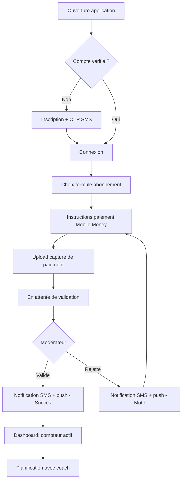
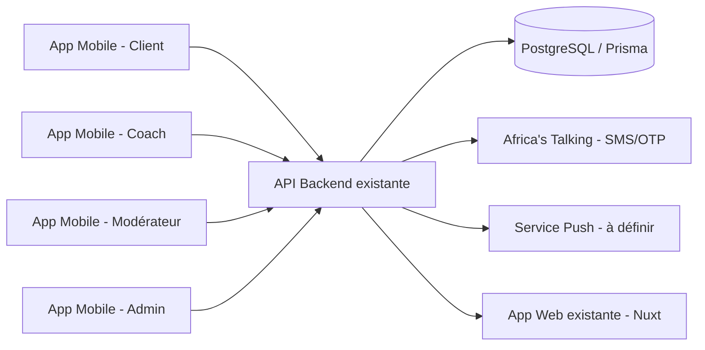
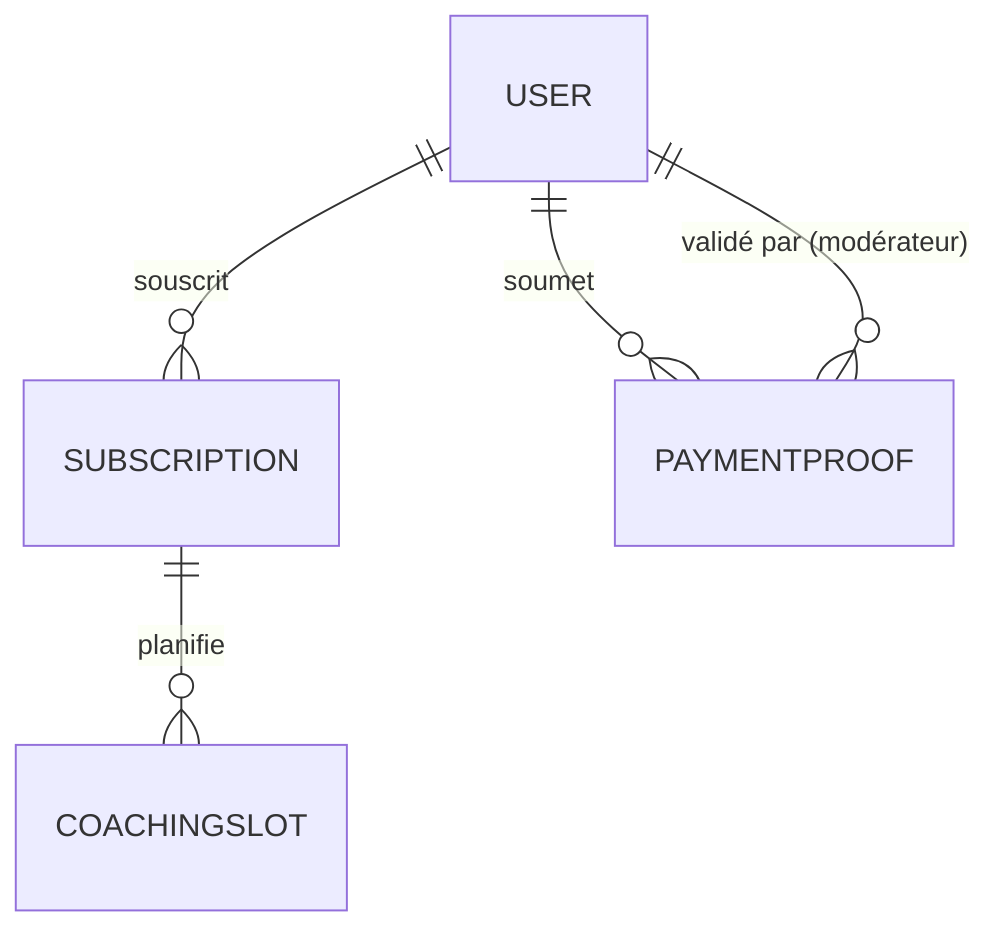

# CAHIER DES CHARGES & FICHE TECHNIQUE
## Souplesse Fitness — Application Mobile (Android/iOS)

*Version consolidée — état du projet en cours de développement*

---

## 1. Résumé exécutif

Souplesse Fitness, salle de sport basée à Cotonou (Bénin), dispose déjà d'une plateforme web (Nuxt 4 / Nitro / Prisma / PostgreSQL) permettant la gestion des abonnements via le prestataire de paiement Kkiapay. Ce cahier des charges couvre le développement d'une **application mobile autonome** (React Native / Expo), distincte du web, destinée à contourner les difficultés rencontrées avec le paiement en ligne intégré, en s'appuyant sur un flux de **paiement manuel Mobile Money vérifié par un modérateur humain**.

[CONFIRMÉ] Le projet est déjà en développement actif : l'architecture d'authentification et la vérification par SMS (OTP) sont en place dans le monorepo `souplesse-speckit` d'origine. **Depuis, une décision de pivot architectural a été prise (voir section 16) : le backend est extrait dans un nouveau dépôt indépendant (`souplesse-api`, NestJS), tandis que l'application mobile reste dans `souplesse-speckit`.** La logique d'authentification/OTP déjà écrite sert de référence fonctionnelle mais est réimplémentée dans le nouveau backend, pas reprise telle quelle.

---

## 2. Contexte et problématique

**Problème à résoudre** : la plateforme web actuelle rencontre des difficultés liées au système de paiement (Kkiapay) qui freinent l'expérience utilisateur et la fiabilité des abonnements.

**Proposition de valeur** : une application mobile dédiée, plus légère et plus fiable, où le paiement Mobile Money est effectué hors application puis validé manuellement — supprimant la dépendance à une passerelle de paiement en ligne tierce pour l'abonnement mobile.

[CONFIRMÉ] Contraintes de départ :
- Environnement de paiement local : Mobile Money via **MTN, Moov, Celtiis**.
- Priorité à la rapidité d'exécution.
- Réutilisation maximale du backend web existant (API, base de données) plutôt que reconstruction complète.
- Développement Android d'abord, iOS prévu ensuite sans être oublié dans la planification.

---

## 3. Vision du produit

Offrir aux membres de Souplesse Fitness une application mobile simple leur permettant de s'abonner, de faire valider leur paiement Mobile Money, de suivre leur abonnement et de planifier leurs séances avec un coach — avec une gestion opérationnelle fluide côté salle (modération des paiements, coaching, administration).

---

## 4. Objectifs

**Objectifs business**
- Réduire les frictions et abandons liés au paiement en ligne.
- Fiabiliser le suivi des abonnements et leur renouvellement (1, 2, 3, 6, 12 mois).
- Professionnaliser la relation client via des tableaux de bord dédiés par rôle.

**Objectifs techniques**
- Réutiliser l'API backend existante (JWT, Prisma/PostgreSQL) sans dupliquer la logique métier.
- Construire une base mobile évolutive (Android → iOS) en React Native/Expo.
- Garantir la sécurité des transactions et données personnelles malgré l'absence de paiement in-app.

---

## 5. Utilisateurs et personas

[CONFIRMÉ] 4 rôles / dashboards distincts : **Client, Coach, Modérateur, Admin** (le web n'en a que 3 : Client/Coach/Admin — le rôle Modérateur est propre au mobile).

| Persona | Profil | Objectifs | Frustrations actuelles | Niveau technique |
|---|---|---|---|---|
| **Client** | Membre de la salle, utilisateur du quotidien | S'abonner, faire valider son paiement rapidement, réserver ses séances | Paiement en ligne peu fiable, incertitude sur la validation | Variable, souvent basique |
| **Coach** | Encadrant sportif | Consulter les clients actifs, planifier les séances | Manque de visibilité sur qui est à jour de cotisation | Basique à intermédiaire |
| **Modérateur** | Personnel administratif dédié au contrôle des paiements | Valider/rejeter rapidement les captures d'écran de paiement | Volume de vérifications manuelles, risque d'erreur | Basique |
| **Admin** | Gestion générale de la salle | Superviser l'ensemble (utilisateurs, abonnements, statistiques) | Manque d'outils consolidés | Intermédiaire |

---

## 6. Périmètre fonctionnel

| ID | Fonctionnalité | Description | Priorité | Utilisateur | Dépendances |
|---|---|---|---|---|---|
| F01 | Inscription/Connexion | Création de compte, connexion JWT, vérification SMS OTP | MUST HAVE | Client, Coach | API auth existante |
| F02 | Choix de formule | Sélection durée d'abonnement (1/2/3/6/12 mois) | MUST HAVE | Client | F01 |
| F03 | Paiement Mobile Money manuel | Affichage du numéro désigné, upload capture d'écran | MUST HAVE | Client | F02 |
| F04 | Validation paiement | File d'attente de captures à valider/rejeter | MUST HAVE | Modérateur | F03 |
| F05 | Notification SMS + push | Notification client à la validation/rejet | MUST HAVE | Client | F04, intégration push [À DÉCIDER] |
| F06 | Tableau de bord Client | Compteur d'abonnement, statut, historique | MUST HAVE | Client | F04 |
| F07 | Planification coach | Le client planifie son programme après validation | SHOULD HAVE | Client, Coach | F06 |
| F08 | Dashboard Coach | Vue des clients actifs et plannings | SHOULD HAVE | Coach | F07 |
| F09 | Dashboard Admin | Vue globale utilisateurs/abonnements/stats | SHOULD HAVE | Admin | F04, F08 |
| F10 | Support iOS | Portage complet de l'app sur App Store | COULD HAVE (phase 2) | Client | Toutes ci-dessus, validées sur Android |

---

## 7. MVP

[CONFIRMÉ/HYPOTHÈSE] Le MVP couvre F01 à F06 sur **Android uniquement** : inscription/connexion avec vérification SMS, sélection de formule, upload de preuve de paiement, validation par un modérateur, notification, tableau de bord client avec compteur d'abonnement.

F07-F09 (planification coach, dashboards Coach/Admin) sont [À VALIDER] pour inclusion en MVP ou en V1 — actuellement traités comme V1 rapprochée compte tenu de la nécessité opérationnelle de ces rôles dès le lancement réel.

F10 (iOS) est explicitement V2/phase ultérieure.

---

## 8. Fonctionnalités détaillées

**F03 — Paiement Mobile Money manuel** [CONFIRMÉ]
- L'application n'intègre aucun SDK de paiement ; elle affiche un numéro Mobile Money désigné (MTN/Moov/Celtiis) et guide le client pour effectuer le transfert hors application.
- Le client uploade une capture d'écran de confirmation de paiement.
- Aucune validation automatique du montant/de la référence n'est effectuée par l'app — la vérification est humaine (Modérateur).

**F05 — Notifications** [CONFIRMÉ décision / À DÉCIDER mécanique]
- Canal double : SMS **et** push à chaque validation/rejet.
- [À DÉCIDER] Fournisseur push (Expo Push Notifications recommandé par défaut vu l'usage d'Expo, ou FCM direct) — non encore mis en place selon les dernières informations.

**F01 — Authentification** [CONFIRMÉ]
- Réutilise l'API JWT existante (login/register/refresh/logout).
- Formulaire d'inscription : Prénom, Nom, Email, Téléphone, Genre (sélecteur obligatoire), Mot de passe, Confirmation — aligné sur le schéma serveur réel (`firstName`/`lastName`/`gender`/`confirmPassword`).
- Vérification de compte mobile : **SMS/OTP obligatoire et bloquant** (haché bcrypt), distinct du mécanisme web (email, non bloquant pour le mobile). Migration Prisma déjà réalisée en production avec garde-fous (vérification PITR Neon).
- Tokens stockés via `expo-secure-store`.

---

## 9. User Stories

**US-01** — En tant que Client, je veux m'inscrire et vérifier mon compte par SMS, afin d'accéder rapidement à l'application sans dépendre de mon email.

*GIVEN* que je viens de créer mon compte
*WHEN* je saisis le code OTP reçu par SMS
*THEN* mon compte est activé et je peux me connecter.

**US-02** — En tant que Client, je veux choisir une formule d'abonnement, afin de démarrer mon paiement Mobile Money.

*GIVEN* que je suis connecté
*WHEN* je sélectionne une durée (1/2/3/6/12 mois)
*THEN* l'application m'affiche le numéro Mobile Money et les instructions de paiement.

**US-03** — En tant que Client, je veux uploader une capture d'écran de paiement, afin de faire valider mon abonnement.

*GIVEN* que j'ai effectué mon paiement Mobile Money
*WHEN* j'uploade la capture d'écran de confirmation
*THEN* ma demande passe en statut "en attente de validation".

**US-04** — En tant que Modérateur, je veux consulter la file des paiements en attente, afin de les valider ou les rejeter.

*GIVEN* qu'une nouvelle capture de paiement est soumise
*WHEN* je l'examine et je clique sur "Valider" ou "Rejeter"
*THEN* le client est notifié par SMS et par push, et son tableau de bord est mis à jour.

**US-05** — En tant que Client, je veux voir un compteur de mon abonnement actif, afin de connaître le temps restant.

*GIVEN* que mon paiement a été validé
*WHEN* j'ouvre mon tableau de bord
*THEN* je vois la durée restante de mon abonnement.

**US-06** — En tant que Client, je veux planifier mon programme avec mon coach, afin d'organiser mes séances.

*GIVEN* que mon abonnement est actif
*WHEN* j'accède à la section planification
*THEN* je peux choisir des créneaux avec un coach disponible.

*(Liste non exhaustive — à compléter au fil des itérations pour F07-F09.)*

---

## 10. Critères d'acceptation

Les critères GIVEN/WHEN/THEN ci-dessus (section 9) constituent la base. Critères transverses :

- Aucun écran ne doit permettre un paiement direct in-app (contrainte produit stricte).
- Le blocage de connexion pour compte mobile non vérifié par SMS doit être strictement appliqué côté serveur (pas seulement côté client).
- Toute action de modération (validation/rejet) doit déclencher les deux canaux de notification (SMS + push) sans exception.

---

## 11. Parcours utilisateurs

### Parcours principal — Abonnement Client

1. Point de départ : ouverture de l'app, utilisateur non connecté.
2. Inscription → vérification OTP SMS → connexion.
3. Sélection d'une formule d'abonnement.
4. Affichage des instructions de paiement Mobile Money.
5. Upload de la capture d'écran de paiement.
6. État intermédiaire : "en attente de validation".
7. Cas nominal : validation par le modérateur → notification SMS + push → compteur actif sur le dashboard.
8. Cas d'erreur : rejet (capture illisible, montant incorrect) → notification avec motif → possibilité de re-soumettre.
9. Cas limite : capture soumise deux fois pour la même période → à traiter par le Modérateur (dédoublonnage manuel, [À VALIDER] si un contrôle automatique est souhaité).
10. Résultat final : abonnement actif, accès à la planification coach.

### Parcours Modérateur

1. Connexion Modérateur → dashboard file d'attente.
2. Consultation d'une capture de paiement.
3. Décision (valider/rejeter) avec motif optionnel.
4. Déclenchement automatique des notifications.

---

## 12. Liste des écrans

| ID | Écran | Objectif | Utilisateur | Navigation |
|---|---|---|---|---|
| E01 | Splash / Auth check | Vérifier session existante | Tous | → E02 ou E05 |
| E02 | Connexion | Authentification | Tous | → E03 (inscription) / E05 |
| E03 | Inscription | Création de compte | Client, Coach | → E04 |
| E04 | Vérification OTP | Saisie code SMS | Client, Coach | → E05 |
| E05 | Dashboard (par rôle) | Point d'entrée post-connexion | Selon rôle | Routage par rôle |
| E06 | Choix formule | Sélection durée abonnement | Client | → E07 |
| E07 | Instructions paiement | Affichage numéro Mobile Money | Client | → E08 |
| E08 | Upload preuve paiement | Envoi capture d'écran | Client | → E09 |
| E09 | Statut en attente | Suivi de la demande | Client | → E05 |
| E10 | File de modération | Liste des paiements à traiter | Modérateur | → E11 |
| E11 | Détail paiement | Validation/rejet | Modérateur | → E10 |
| E12 | Planification coach | Choix créneau | Client | → E05 |
| E13 | Dashboard Coach | Vue clients/plannings | Coach | — |
| E14 | Dashboard Admin | Vue globale | Admin | — |

Pour chaque écran : états loading/empty/success/error/offline à spécifier lors du détail UI (non encore formalisés dans le backlog actuel — [À DÉCIDER] pour chaque écran individuellement lors de la phase maquette détaillée).

---

## 13. UX/UI

[CONFIRMÉ] Les premières maquettes (parcours abonnement/paiement, connexion/inscription, 4 dashboards) ont été validées sans réserve. Ordre de travail retenu : **maquette/UI d'abord, puis backend** — cohérent avec l'avancement actuel où l'auth backend est en place pendant que l'UI continue d'être affinée.

[À DÉCIDER] États offline des écrans, gestion des erreurs réseau à l'upload de capture (fichier volumineux sur connexion faible — cas fréquent en contexte local).

---

## 14. Design System

[HYPOTHÈSE — à valider] En l'absence de spécification graphique fournie dans le projet, un Design System minimal est recommandé pour la cohérence Android/iOS :
- Composants standards (boutons, inputs, cards, modales, toasts, loaders) alignés sur Material Design (Android en premier) avec adaptation iOS ultérieure.
- Mode sombre : [À DÉCIDER] — non mentionné comme prioritaire.
- Accessibilité mobile de base (contraste, zones tactiles ≥ 44px) à respecter dès le MVP.

---

## 15. Architecture fonctionnelle

---

## 16. Architecture technique

[CONFIRMÉ — mis à jour suite au pivot architectural] Le projet est désormais réparti sur **deux dépôts** :
- **`souplesse-speckit`** (monorepo existant) : conserve l'app web (Nuxt 4/Nitro/Prisma/PostgreSQL) **et** l'application mobile (dossier `mobile/`, React Native/Expo). La documentation produit/spec du mobile vit dans `specs/2-mobile-app/` de ce dépôt.
- **`souplesse-api`** (nouveau dépôt indépendant, sans historique lié à l'ancien monorepo) : héberge le **nouveau backend NestJS**, dédié à l'application mobile, détaillé dans `architecture.md`. Ce backend remplace l'ancienne approche de réutilisation directe du backend Nitro pour le mobile (voir section 18, mise à jour).

L'application mobile ne consomme plus le backend Nitro embarqué du monorepo web : elle appelle exclusivement l'API exposée par `souplesse-api`.

---

## 17. Architecture mobile

[CONFIRMÉ] React Native / Expo, ciblant Android puis iOS. Reste dans le monorepo `souplesse-speckit` (dossier `mobile/`).
- Authentification : tokens stockés via `expo-secure-store`.
- URL API configurable via `EXPO_PUBLIC_API_URL` — **pointe désormais vers le nouveau backend `souplesse-api`** (instance Render.com gratuite pendant la phase de démo sans budget ; `api.souplessefitness.com` une fois le VPS DigitalOcean financé — voir `architecture.md` section 9bis), et non plus vers `https://souplessefitness.com/api` (ancien backend embarqué).
- Routage post-connexion basé sur le rôle utilisateur vers le dashboard correspondant.

[À DÉCIDER] Architecture applicative précise (feature-first vs couches classiques), solution de state management (Context API, Zustand, Redux Toolkit — à trancher selon la complexité des dashboards à venir), stratégie de cache local.

---

## 18. Architecture backend

[CONFIRMÉ — mis à jour suite au pivot architectural] Le backend n'est **plus** une réutilisation directe du backend web Nitro/Prisma embarqué. Un **nouveau backend NestJS autonome** est développé dans le dépôt `souplesse-api` (voir `architecture.md` pour la structure des modules, le contrat d'API et le plan de migration). Il réutilise le **schéma Prisma existant** (base Neon partagée en lecture des mêmes entités utilisateur) mais tourne comme un service indépendant, avec sa propre codebase, ses propres tests et son propre déploiement — il ne modifie pas le comportement du backend Nitro qui continue de servir l'app web.

Le schéma utilisateur reste étendu (migration additive déjà appliquée) pour distinguer l'origine web/mobile d'un compte et gérer la vérification SMS spécifique au mobile.

[À DÉCIDER] Implémentation des routes SMS Africa's Talking et des routes de notification push liées à la validation/rejet de paiement dans la nouvelle structure NestJS (voir `architecture.md` section 5).

---

## 19. Base de données

[CONFIRMÉ] PostgreSQL géré via Neon, ORM Prisma. **Précision suite au pivot** : le nouveau backend `souplesse-api` doit se connecter à une **base Neon de développement/test distincte de la production** pendant la phase de démo sans budget (branche Neon séparée ou projet Neon dédié) — voir le garde-fou correspondant dans `handoff.md`. La base de production (utilisée par le web et par l'ancien code mobile embarqué) n'est jamais touchée directement pendant cette phase. Garde-fou permanent : vérification PITR avant toute migration appliquée en production, tests locaux via docker-compose Postgres avant application en production.

Entités principales concernées par le mobile (à formaliser en ERD complet lors du détail technique) :
- `User` (étendu : origine web/mobile, `smsVerified`, `otpCodeHash`, `gender`, etc.)
- `Subscription` (durée, statut, dates)
- `PaymentProof` (capture d'écran, statut validation, modérateur, motif de rejet)
- `CoachingSlot` (planification coach/client)

---

## 20. API

[CONFIRMÉ] Endpoints d'authentification déjà en place : login, register, refresh, logout, vérification email (web), et nouveaux endpoints OTP SMS (mobile).

[À DÉCIDER / manquant] Endpoints spécifiques au flux paiement manuel (soumission preuve, liste modération, validation/rejet) et à la planification coach — non confirmés comme existants à ce stade ; à spécifier précisément (méthode, payload, codes d'erreur) avant implémentation.

| Méthode | Endpoint (proposé) | Description | Auth |
|---|---|---|---|
| POST | /api/auth/register | Inscription mobile | Non |
| POST | /api/auth/verify-otp | Vérification SMS | Non |
| POST | /api/auth/login | Connexion | Non |
| POST | /api/subscriptions | Choix de formule | Client |
| POST | /api/payment-proofs | Upload capture de paiement | Client |
| GET | /api/payment-proofs?status=pending | File de modération | Modérateur |
| PATCH | /api/payment-proofs/:id | Valider/rejeter | Modérateur |
| GET | /api/coaching-slots | Créneaux disponibles | Client |

---

## 21. Authentification

[CONFIRMÉ, détaillé en section 8] JWT + refresh token, vérification SMS bloquante pour le mobile, email inchangé pour le web. [À DÉCIDER] Politique d'expiration précise des tokens, gestion des sessions multiples, révocation.

---

## 22. Sécurité

[CONFIRMÉ]
- OTP haché avec bcrypt (jamais stocké en clair).
- Incident de sécurité déjà traité et clos : régénération du mot de passe Neon, mise à jour `.env`/variables Vercel.
- Toute migration de schéma en production passe par une procédure de garde-fou écrite avant exécution.

[À DÉCIDER / prioritaire, demandé explicitement]
- Politique de conservation et de suppression des captures d'écran de paiement (données sensibles).
- Contrôle d'accès strict par rôle (Modérateur ne doit voir que les paiements, pas les données personnelles complètes des clients au-delà du nécessaire).
- Protection contre l'upload de fichiers malveillants (validation type/taille des captures).

---

## 23. Performance

[HYPOTHÈSE, à valider] Objectifs proposés pour un contexte de connectivité mobile variable en Afrique de l'Ouest :
- Temps de démarrage < 3s.
- Compression des images avant upload (captures de paiement) pour limiter la consommation data.
- Pagination sur la file de modération et l'historique d'abonnement.

---

## 24. Offline-first

[À DÉCIDER] Non traité à ce stade dans les échanges. Recommandation minimale : mise en cache du dashboard (dernier état connu) pour affichage en cas de perte de réseau, avec file d'attente pour les uploads de preuve de paiement échoués (retry automatique).

---

## 25. Notifications

[CONFIRMÉ] SMS + push obligatoires à chaque validation/rejet de paiement.
[CONFIRMÉ] Fournisseur push retenu : **Expo Push Notifications** — mise en place rapide (pas de configuration Firebase manuelle), cohérent avec la stack Expo déjà en place. Migration vers FCM direct envisageable plus tard si les limites de débit du plan gratuit Expo deviennent contraignantes.

---

## 26. Intégrations externes

| Service | Utilité | Statut | Criticité | Alternative |
|---|---|---|---|---|
| Africa's Talking | SMS/OTP | [CONFIRMÉ] retenu, à réintégrer dans `souplesse-api` derrière l'interface `SmsProvider` | Critique | eSMS Africa (test comparatif prévu, voir `architecture.md` section 5.1) |
| Expo Push Notifications | Notifications push | [CONFIRMÉ] retenu | Critique | FCM direct (si limites de débit atteintes) |
| Neon (PostgreSQL) | Base de données | [CONFIRMÉ] en place — utilisé à la fois par le web et par `souplesse-api` (bases distinctes dev/prod) | Critique | — |
| Vercel | Hébergement de l'**app web** uniquement | [CONFIRMÉ] en place, inchangé | Critique (pour le web) | — |
| Render.com (gratuit) | Hébergement provisoire de `souplesse-api` pendant la phase de démo sans budget | [CONFIRMÉ] retenu | Élevée le temps de la démo | VPS DigitalOcean une fois financé |
| DigitalOcean (VPS) | Hébergement cible de `souplesse-api` une fois le financement obtenu | [À VENIR] non actif tant que le financement n'est pas obtenu | — | — |

Aucun prestataire de paiement en ligne n'est intégré côté mobile — décision produit assumée. **Vercel n'héberge plus l'API consommée par le mobile** depuis le pivot architectural — seul le web continue d'y tourner.

---

## 27. DevOps / CI-CD

[CONFIRMÉ — mis à jour suite au pivot architectural] Le mobile (`souplesse-speckit/mobile/`) et le backend (`souplesse-api`) ont désormais des cycles CI/CD **distincts** :
- **Mobile** : reste dans `souplesse-speckit`, branche `feat/mobile-app` → revue → merge vers `master` pour le code applicatif Expo/React Native. Build Android via **EAS Build** (`eas build --platform android --profile preview` pour l'APK de démo, profil de production plus tard pour la publication Play Store).
- **Backend `souplesse-api`** : cycle CI/CD propre à son propre dépôt, détaillé dans `architecture.md` section 9 (VPS, une fois financé) et 9bis (Render.com, phase de démo sans budget) — pipeline GitHub Actions avec déploiement staging automatique et déploiement production avec validation manuelle sur tag de release (cible une fois le VPS en place).
- Secrets : les secrets de `souplesse-api` (clé Africa's Talking, JWT secret, connexion Neon) vivent dans les variables d'environnement de Render.com (phase démo) puis du VPS (phase financée) — **plus dans les variables Vercel**, qui ne couvrent que le web. Les secrets mobile (EAS) restent gérés via EAS Secrets.

[CONFIRMÉ] Décision : un **environnement de staging séparé de la production doit être mis en place avant la Beta publique** (base de données et API distinctes de la production, `EXPO_PUBLIC_API_URL` pointant vers le staging pour les builds de test) — mis en œuvre une fois le VPS DigitalOcean financé (`architecture.md` section 9). **Pendant la phase de démo actuelle**, une base Neon de développement distincte de la production suffit (voir section 19) ; un vrai environnement de staging séparé n'est pas encore nécessaire tant qu'il n'y a pas d'utilisateurs réels. Cela lève progressivement le risque R01 identifié en section Risques.

---

## 28. Tests

[À DÉCIDER] Aucune stratégie de test mobile formalisée à ce stade. Minimum recommandé avant mise en production :
- Tests unitaires sur la logique métier critique (calcul de durée d'abonnement, validation OTP).
- Tests d'intégration sur les nouvelles routes SMS/paiement.
- Tests manuels de bout en bout du parcours abonnement sur devices Android réels (contexte réseau variable).

---

## 29. Monitoring

[À DÉCIDER] Non mis en place. Recommandation : crash reporting mobile (Sentry ou équivalent compatible Expo), suivi des taux d'échec d'upload de preuve de paiement et de délai moyen de modération.

---

## 30. Accessibilité

[HYPOTHÈSE] Non abordé explicitement — recommandation de base : contraste suffisant, tailles de police ajustables, zones tactiles adaptées, support TalkBack a minima pour les écrans critiques (connexion, upload de paiement).

---

## 31. Internationalisation

[HYPOTHÈSE] Application actuellement destinée au marché béninois francophone. Pas de besoin multilingue identifié à ce stade ; architecture à préparer pour un ajout futur si extension régionale.

---

## 32. Conformité

*(Point demandé comme prioritaire.)*

**Analyse fondée sur la Loi n°2017-20 portant Code du numérique (Livre V — protection des données à caractère personnel), articles 391 à 449.**

- [CONFIRMÉ] **Obligation de déclaration à l'APDP** (Art. 405) : tout traitement de données à caractère personnel doit faire l'objet d'une déclaration préalable auprès de l'Autorité de Protection des Données à caractère Personnel (APDP). L'app (nom, téléphone, email, genre, capture de paiement) relève de ce régime général.
- [CONFIRMÉ] L'app ne relève **pas** du régime plus lourd d'autorisation préalable (Art. 407 : données biométriques, numéro national d'identification, interconnexion de fichiers, transfert vers un État tiers, finalités d'intérêt public) — une **simple déclaration** suffit.
- [CONFIRMÉ] Le téléphone, l'email, le genre et une capture de paiement Mobile Money **ne sont pas des "données sensibles"** au sens strict de l'Art. 394 (origine raciale/ethnique, opinions politiques, religion, syndicat, données biométriques/génétiques, santé, vie sexuelle) — à traiter néanmoins avec précaution en pratique.
- [CONFIRMÉ] Désignation d'un **délégué à la protection des données (DPO) non obligatoire** (Art. 430) : ce seuil ne s'applique qu'aux organismes publics, au suivi régulier/systématique à grande échelle, ou au traitement à grande échelle de données sensibles — aucun de ces cas ne concerne Souplesse Fitness. Une désignation volontaire reste possible et simplifie l'obligation de déclaration (Art. 408).
- [CONFIRMÉ] Obligations concrètes à respecter dans tous les cas : information des personnes sur la finalité et la durée de conservation (Art. 415-416), sécurisation technique et organisationnelle proportionnée (Art. 426), non-conservation au-delà du nécessaire (Art. 433 — la politique de suppression des captures après validation y répond déjà), registre des traitements (Art. 435), droits d'accès/rectification/suppression/opposition (Art. 437-441).
- [CONFIRMÉ] Politique de conservation des captures de paiement : suppression après validation, le client devant en soumettre une nouvelle à chaque demande d'abonnement — cohérent avec l'Art. 433.
- [À DÉCIDER] **Démarche de déclaration APDP : pas encore engagée, à planifier.** Prochaine étape concrète : préparer le dossier de déclaration (identité du responsable de traitement, finalités, catégories de données, durée de conservation, mesures de sécurité — contenu requis listé à l'Art. 409) et le déposer auprès de l'APDP. Délai légal de réponse de l'Autorité : 60 jours, prorogeable une fois de 30 jours (Art. 412) ; passé ce délai, la réponse est réputée favorable.
- **Règles Google Play Store** : politique de confidentialité publique et formulaire Data Safety déclarant précisément les captures de paiement et numéros de téléphone collectés.
- **Règles App Store (phase iOS ultérieure)** : contraintes Apple sur les apps de paiement manuel/preuve de transaction à anticiper — point de vigilance [RISQUE].

[À DÉCIDER] Rédaction d'une politique de confidentialité dédiée à l'app mobile, mécanisme de consentement explicite à la collecte du numéro de téléphone et des captures de paiement.

Une **validation juridique locale formelle** reste recommandée avant la mise en production, mais l'essentiel de la démarche réglementaire est désormais clarifié par cette analyse du Code du numérique.

---

## 33. Backlog

**EPIC 1 — Authentification mobile** ✅ en grande partie réalisé
- Inscription, connexion, vérification OTP SMS (fait) ; gestion sessions/révocation (à définir)

**EPIC 2 — Abonnement & Paiement manuel**
- Choix de formule, upload preuve, file de modération, validation/rejet (à développer)

**EPIC 3 — Notifications**
- Intégration SMS de notification (distincte de l'OTP), choix et intégration du service push

**EPIC 4 — Dashboards**
- Dashboard Client (compteur), Coach (plannings), Modérateur (file), Admin (vue globale)

**EPIC 5 — Planification coach**

**EPIC 6 — Conformité & Sécurité**
- Politique de confidentialité, déclaration APDP, Data Safety Google Play

**EPIC 7 — Portage iOS** (V2)

---

## 34. Estimation

[HYPOTHÈSE — à affiner avec l'équipe] Ne pas donner une précision artificielle ; ordres de grandeur en jours-homme pour les EPICs restants (hors ce qui est déjà fait) :

| Scénario | Estimation globale restante |
|---|---|
| Optimiste | 25-30 jours-homme |
| Réaliste | 40-50 jours-homme |
| Pessimiste | 65-80 jours-homme |

Facteurs d'incertitude : intégration push non tranchée, absence d'environnement de test séparé de la production (ralentit chaque migration), volet conformité pouvant impliquer des allers-retours juridiques.

---

## 35. Équipe

[HYPOTHÈSE] Compte tenu du contexte (projet piloté par un développeur/entrepreneur unique avec assistance IA - Claude Code) :

| Rôle | Charge approximative |
|---|---|
| Développeur mobile/backend (rôle actuel) | Continu |
| Modérateur métier (test utilisateur du flux de validation) | Ponctuel, avant lancement |
| Conseil juridique local (conformité APDP) | Ponctuel |

---

## 36. Roadmap

| Phase | Objectif | Statut |
|---|---|---|
| 0 — Discovery | Analyse besoin, choix stack | ✅ Fait |
| 1 — Architecture | Monorepo, auth JWT, SMS OTP | ✅ Fait / en finalisation |
| 2 — UX/UI | Maquettes validées | ✅ Fait |
| 3 — MVP | Paiement manuel + modération + dashboard client | 🔄 En cours |
| 4 — Tests | Tests bout en bout Android | ⏳ À planifier |
| 5 — Beta | Test réel avec quelques membres | ⏳ À planifier |
| 6 — Production | Lancement Play Store | ⏳ À planifier |
| 7 — Scale / iOS | Portage App Store, dashboards Coach/Admin avancés | ⏳ Futur |

---

## 37. Risques

| ID | Risque | Probabilité | Impact | Mitigation |
|---|---|---|---|---|
| R01 | Pas de DB de test séparée de la prod | Moyenne | Élevé | **Résolu par décision** : mise en place d'un environnement de staging séparé avant la Beta publique |
| R02 | Rejet App Store pour paiement hors-app d'un service payant | Moyenne | Élevé | Documenter le flux pour Apple, prévoir alternative si nécessaire (phase iOS) |
| R03 | Non-conformité APDP (données financières/personnelles) | Moyenne | Élevé | Déclaration APDP à déposer (dossier à préparer selon Art. 409) — démarche pas encore engagée |
| R04 | Fraude sur preuve de paiement (capture falsifiée) | Moyenne | Moyen | Contrôle humain rigoureux, formation du Modérateur, éventuel contrôle croisé futur |
| R05 | Absence de service push choisi retarde F05 | Faible | Moyen | Trancher rapidement (Expo Push recommandé) |

---

## 38. KPI

- Taux de validation de paiement en moins de X heures (délai moyen de modération).
- Taux d'échec d'upload de preuve de paiement.
- Taux de conversion inscription → abonnement validé.
- Taux de rétention (renouvellement d'abonnement).
- Nombre de rejets pour cause de fraude/erreur.

---

## 39. Hypothèses

- Aucune interface graphique formelle (charte) n'a été fournie — un Design System minimal Material-first est proposé par défaut.
- Le service de notification push n'est pas encore choisi ; Expo Push est proposé par défaut vu la stack Expo.
- L'estimation de charge (section 34) suppose une équipe réduite (1 développeur assisté d'IA).

---

## 40. Questions ouvertes

- ~~Quel service de notification push retenir ?~~ → **Tranché : Expo Push Notifications.**
- ~~Politique de conservation des captures de paiement ?~~ → **Tranché : suppression après validation, nouvelle capture requise à chaque demande.**
- ~~Environnement de staging séparé avant la Beta ?~~ → **Tranché : oui, à mettre en place avant la Beta publique.**
- Dédoublonnage des soumissions de paiement pour une même période (deux demandes en attente en parallèle) : automatisé ou repérage manuel par le Modérateur au démarrage ? — encore ouvert, probablement gérable manuellement au lancement.
- La déclaration auprès de l'APDP reste à préparer et déposer (dossier non encore engagé) — quel délai le porteur de projet souhaite-t-il se fixer pour ce dépôt ?
- Qui rédige la politique de confidentialité publique requise par l'APDP et par Google Play (Data Safety) ?

---

## 41. Recommandations finales

1. Implémenter l'intégration Expo Push (fournisseur désormais tranché) pour débloquer l'EPIC 3.
2. **Préparer et déposer le dossier de déclaration APDP dès maintenant** (contenu requis : identité du responsable, finalités, catégories de données, durée de conservation, mesures de sécurité — Art. 409) ; délai de réponse légal de 60 jours (prorogeable de 30) à anticiper avant tout lancement public.
3. Mettre en place l'environnement de staging séparé de la production avant la Beta publique (décision prise) — cela lève le risque R01 et sécurise toute future migration de schéma.
4. Rédiger la politique de confidentialité publique (nécessaire à la fois pour l'APDP et pour le Data Safety de Google Play) en s'appuyant sur les obligations d'information des Art. 415-416.
5. Documenter précisément le flux de paiement manuel pour anticiper une éventuelle question de l'App Store lors de la phase iOS.
6. Formaliser une politique claire de gestion des rejets/fraudes et du dédoublonnage de soumissions pour le rôle Modérateur avant l'ouverture au public.

---

### CHECKLIST CTO

- [x] Vision claire
- [x] Problème clairement défini
- [x] Personas définis
- [x] MVP défini
- [x] Fonctionnalités spécifiées (niveau macro)
- [x] User Stories présentes (échantillon, à compléter)
- [x] Critères d'acceptation présents
- [x] Parcours utilisateurs définis
- [x] Écrans définis (liste)
- [x] Architecture définie
- [ ] Stack justifiée par comparaison chiffrée (Flutter vs RN non comparé — RN/Expo déjà choisi et engagé)
- [x] Base de données définie (niveau macro)
- [ ] APIs définies précisément (endpoints paiement/modération à spécifier)
- [x] Authentification définie
- [ ] Sécurité totalement analysée (conservation des preuves à trancher)
- [ ] Performance définie précisément (objectifs chiffrés à valider)
- [ ] Offline analysé (non traité)
- [x] Notifications finalisées (fournisseur push tranché : Expo Push)
- [x] Intégrations identifiées
- [ ] CI/CD défini précisément
- [ ] Tests définis précisément
- [ ] Monitoring défini
- [ ] Accessibilité définie précisément
- [x] Internationalisation analysée (non nécessaire actuellement)
- [x] Conformité analysée en détail (régime de déclaration APDP identifié via le Code du numérique — dépôt du dossier restant à faire)
- [x] Backlog défini (niveau EPIC)
- [x] Estimation réalisée
- [x] Roadmap définie
- [x] Risques identifiés
- [x] KPI définis
- [x] Hypothèses identifiées
- [x] Questions ouvertes identifiées

**Note de maturité du projet : 74/100**

Les 5 principaux éléments empêchant d'atteindre 100/100 :
1. Dossier de déclaration APDP pas encore préparé ni déposé (démarche identifiée mais pas engagée).
2. Endpoints API du flux paiement/modération non spécifiés dans le détail (méthodes, payloads, erreurs).
3. Stratégies CI/CD, tests et monitoring mobiles non formalisées.
4. Politique de confidentialité publique pas encore rédigée.
5. Mise en place effective de l'environnement de staging non encore réalisée (décision prise, exécution restante).
